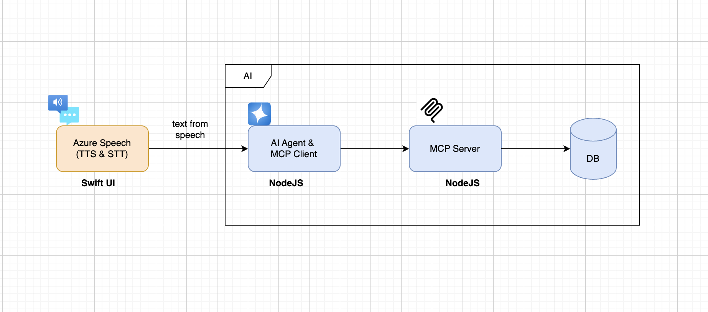

# MCP JavaScript Example

This repository demonstrates a Model Context Protocol (MCP) implementation with a JavaScript server and client, integrated with LangChain and OpenAI.

## Project Structure

```
mcp_poc/
├── mcp-js-server/    # MCP Server with clinical tools
└── mcp-js-client/    # MCP Client with LLM integration
```

## Features

### MCP Server (`mcp-js-server/`)
- **Clinical risk assessment tools** via MCP protocol
- **HTTP/JSON-RPC endpoint** for easy integration
- **Three tools available:**
  - `calculate_risk_score` - Computes clinical risk scores from age and comorbidity count
  - `get_patient_health_conditions` - Retrieves health conditions for a patient
  - `get_patient_summary` - Returns complete patient demographic and condition summary

### MCP Client (`mcp-js-client/`)
- **LangChain integration** with OpenAI/Azure OpenAI
- **Automatic tool discovery** from MCP server
- **LLM-powered tool calling** - AI decides when and how to use tools
- **Multiple test scenarios** demonstrating real-world usage

## Prerequisites

- Node.js v20+
- npm or yarn
- OpenAI API key or Azure OpenAI credentials

## Setup

### 1. Clone the repository

```bash
git clone git@github.com:kumarchitta/mcp_js_example.git
cd mcp_js_example
```

### 2. Install Server Dependencies

```bash
cd mcp-js-server
npm install
```

### 3. Install Client Dependencies

```bash
cd ../mcp-js-client
npm install
```

### 4. Configure Environment Variables

Create a `.env` file in `mcp-js-client/`:

```env
# For OpenAI
OPENAI_API_KEY=your_openai_api_key
MODEL_PROVIDER=openai

# OR for Azure OpenAI
# MODEL_PROVIDER=azure
# AZURE_API_KEY=your_azure_api_key
# AZURE_ENDPOINT=https://your-resource.openai.azure.com
# AZURE_DEPLOYMENT_NAME=gpt-4o
```

## Usage

### Start the MCP Server

```bash
cd mcp-js-server
npm run dev
```

The server will start at `http://localhost:8080/mcp`

### Run the MCP Client

In a new terminal:

```bash
cd mcp-js-client
npm run dev
```

The client will:
1. Connect to the MCP server
2. Load available tools
3. Run 6 test queries demonstrating LLM + MCP integration
4. Display results and tool calls

## Example Output

```
✅ Loaded 3 tools from MCP server:
   • calculate_risk_score — Compute a clinical risk score from age and comorbidity count.
   • get_patient_health_conditions — Retrieve known health conditions for a patient.
   • get_patient_summary — Return demographic and condition summary for a patient.

📝 Test 1/6:
Query: "Calculate the risk score for a 72-year-old patient with 5 comorbidities."

✨ Final LLM Response: The risk score for a 72-year-old patient with 5 comorbidities is 39.4, which falls into the "medium" risk category.
```

## Mock Data

The server includes mock patient data:
- **P001**: Alice Johnson (68 years, 3 comorbidities)
- **P002**: Robert Smith (45 years, 1 comorbidity)
- **P003**: Maria Lopez (72 years, 5 comorbidities)

## Direct API Testing

You can also test the server directly with curl:

```bash
# Query patient health conditions
curl -X POST http://localhost:8080/mcp \
  -H "Content-Type: application/json" \
  -d '{
    "jsonrpc": "2.0",
    "id": 1,
    "method": "tools/call",
    "params": {
      "name": "get_patient_health_conditions",
      "arguments": { "patientId": "P001" }
    }
  }'
```

## MCP Inspector
```bash
  npx @modelcontextprotocol/inspector
```

## Architecture

```
┌─────────────┐         ┌─────────────┐         ┌─────────────┐
│             │         │             │         │             │
│  OpenAI/    │◄────────│  MCP Client │◄────────│  MCP Server │
│  Azure      │  Tools  │  (LangChain)│  HTTP   │  (Express)  │
│             │         │             │         │             │
└─────────────┘         └─────────────┘         └─────────────┘
                             │                        │
                             │                        │
                        Decides when              Executes
                        to call tools             clinical tools
```

## Technologies Used

- **@modelcontextprotocol/sdk** - MCP protocol implementation
- **@langchain/openai** - LangChain OpenAI integration
- **@langchain/core** - LangChain core tools
- **Express** - HTTP server
- **Zod** - Schema validation

## License

ISC

## Author

Aswani Kumar Chitta

